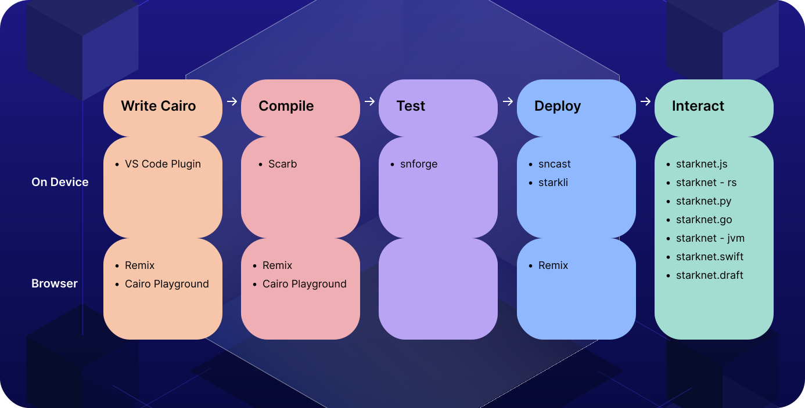

# StarkNet Material


https://www.starknet.io/

https://docs.starknet.io/

https://x.com/Starknet

https://www.youtube.com/@starknet_foundation

"Starknet is the secure scaling technology bringing Ethereum’s benefits to the world."

https://starkware.co/

---

STARKGATE BRIDGE: https://starkgate.starknet.io/bridge/deposit

ARGENT WALLET: https://www.argent.xyz/argent-x

BRAAVOS WALLET: https://braavos.app/

STRK TOKEN: https://coinmarketcap.com/currencies/starknet-token/

CAIRO BOOK: https://book.cairo-lang.org/ https://www.cairo-lang.org/

BLOCK EXPLORER: https://starkscan.co/

VOYAGER BLOCK EXPLORER: https://sepolia.voyager.online/

DAPPS: https://www.starknet.io/dapps/

GRANTS: https://www.starknet.io/grants/

FAUCET: https://starknet-faucet.vercel.app/ https://www.alchemy.com/faucets/starknet-sepolia https://blastapi.io/faucets/starknet-sepolia-strk

NATIVE ACCOUNT ABTRACTION: https://www.starknet.io/blog/account-abstraction/native-account-abstraction/

DOJO GAME ENGINE: https://dojoengine.com/

POSSIBLE TO USE REMIX IDE TO MANAGE CAIRO CONTRACTS: https://remix.ethereum.org/

NFT MARKETPLACE: https://unframed.co/

SPEEDRUN STARKNET: https://speedrunstark.com/

UTILS: https://www.stark-utils.xyz/

DEVTOOLS DOCS: https://docs.starknet.io/tools/devtools/overview/

VSCODE EXTENSION: https://docs.starknet.io/tools/devtools/vscode/

STARKNET REACT: https://github.com/apibara/starknet-react https://docs.starknet.io/tools/devtools/libs-for-dapps/

SCAFFOLD: https://scaffoldstark.com/ https://www.starknetscaffold.xyz/ https://docs.starknet.io/tools/devtools/dapp-frameworks/

OPENZEPPELIN CONTRACT WIZZARD: https://wizard.openzeppelin.com/cairo

RPC REQUEST BUILDER: https://rpc-request-builder.voyager.online/

CAIRO PLAYGROUND: https://www.cairo-lang.org/cairovm/

ORACLES: https://docs.starknet.io/tools/oracles/

AI AGENT: https://agent.starknet.id/

USC: https://github.com/software-mansion/universal-sierra-compiler cargo install universal-sierra-compiler

---

Commands:

```

scarb --version

scarb new hello_world

cd hello_world

scarb build

scarb cairo-run

scarb test

scarb fmt

```

---

[Examples of Dapp Ideas on Starknet](DAPPS.md)


